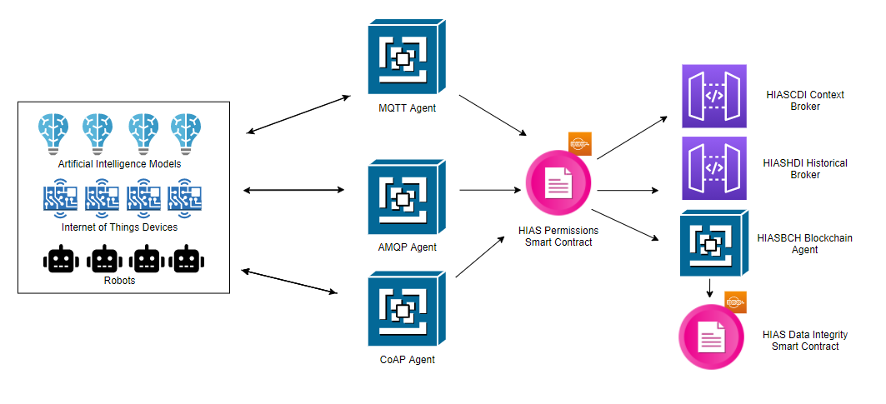

# Asociación de Investigacion en Inteligencia Artificial Para la Leucemia Peter Moss
# HIAS - Hospital Intelligent Automation Server
## HIASBCH Private Ethereum Blockchain

       
 

&nbsp;

# Introduction

**HIASBCH** is a dedicated **Ethereum Blockchain** providing authentication & data integrity functionality to the HIAS Network. HIASBCH is being developed as an implementation of the [EBSI Blockchain](https://ec.europa.eu/cefdigital/wiki/display/CEFDIGITAL/EBSI) and will align with European values and regulations.

HIASBCH includes the following features:

- HIASBCH Private Ethereum Blockchain
- HIASBCH Component (Replenishes HIASBCH Smart Contracts and indexes blocks, addresses, transactions and receipts)
- HIASBCH Permissions Smart Contract
- HIASBCH Data Integrity Smart Contract

&nbsp;

# GETTING STARTED

Head over to the [Getting Started guide](docs/index.md) for instructions on how to download/install and setup the HIASBCH Private Ethereum Blockchain.

&nbsp;

# Contributing
Asociación de Investigacion en Inteligencia Artificial Para la Leucemia Peter Moss encourages and welcomes code contributions, bug fixes and enhancements from the Github community.

Please read the [CONTRIBUTING](CONTRIBUTING.md "CONTRIBUTING") document for a full guide to contributing to our research project. You will also find our code of conduct in the [Code of Conduct](CODE-OF-CONDUCT.md) document.

## Contributors
- [Adam Milton-Barker](https://www.leukemiaairesearch.com/association/volunteers/adam-milton-barker "Adam Milton-Barker") - [Asociación de Investigacion en Inteligencia Artificial Para la Leucemia Peter Moss](https://www.leukemiaresearchassociation.ai "Asociación de Investigacion en Inteligencia Artificial Para la Leucemia Peter Moss") President/Founder & Lead Developer, Sabadell, Spain

&nbsp;

# Versioning
We use [SemVer](https://semver.org/) for versioning.

&nbsp;

# License
This project is licensed under the **MIT License** - see the [LICENSE](LICENSE "LICENSE") file for details.

&nbsp;

# Bugs/Issues
We use the [repo issues](issues "repo issues") to track bugs and general requests related to using this project. See [CONTRIBUTING](CONTRIBUTING.md "CONTRIBUTING") for more info on how to submit bugs, feature requests and proposals.