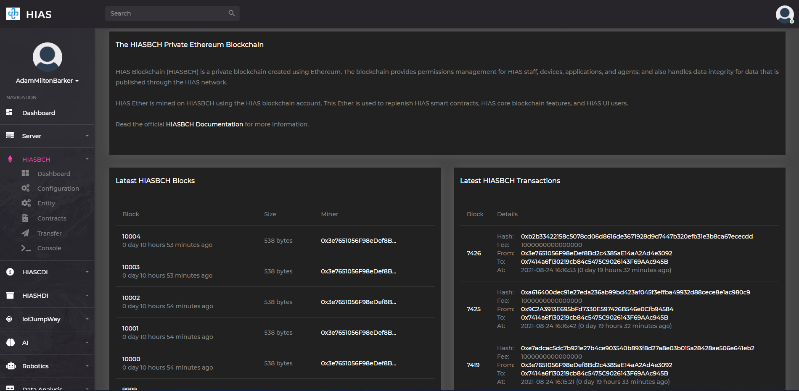
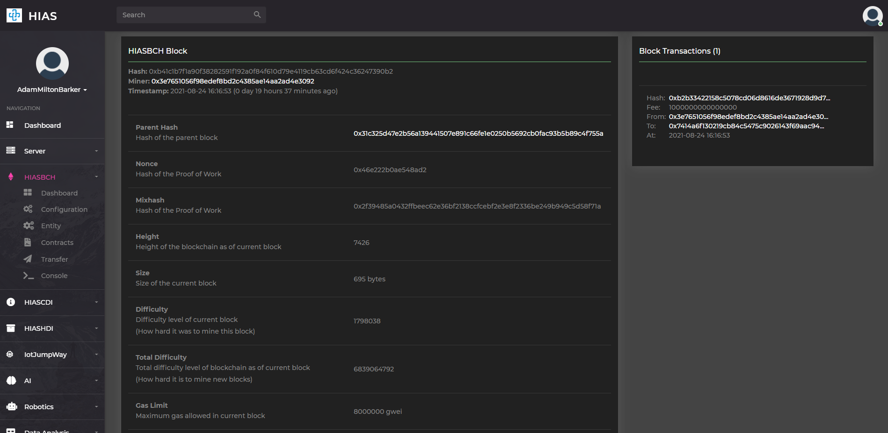
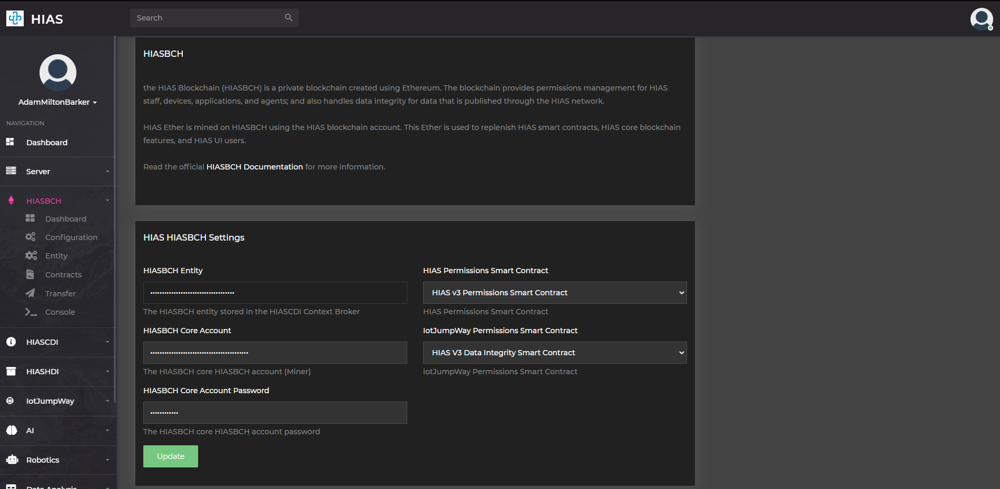
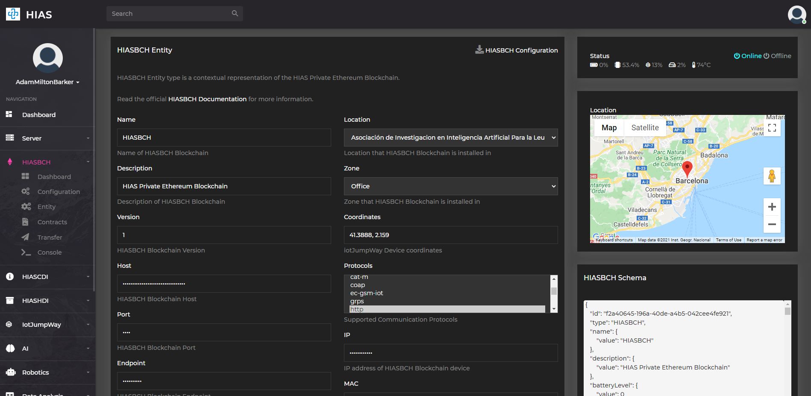
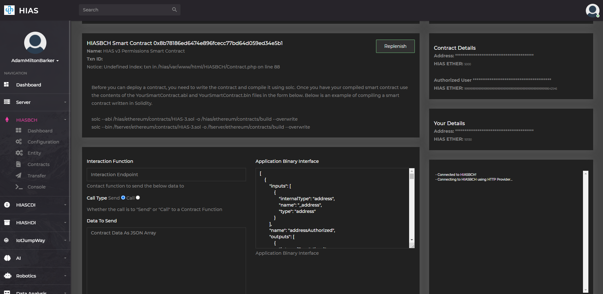
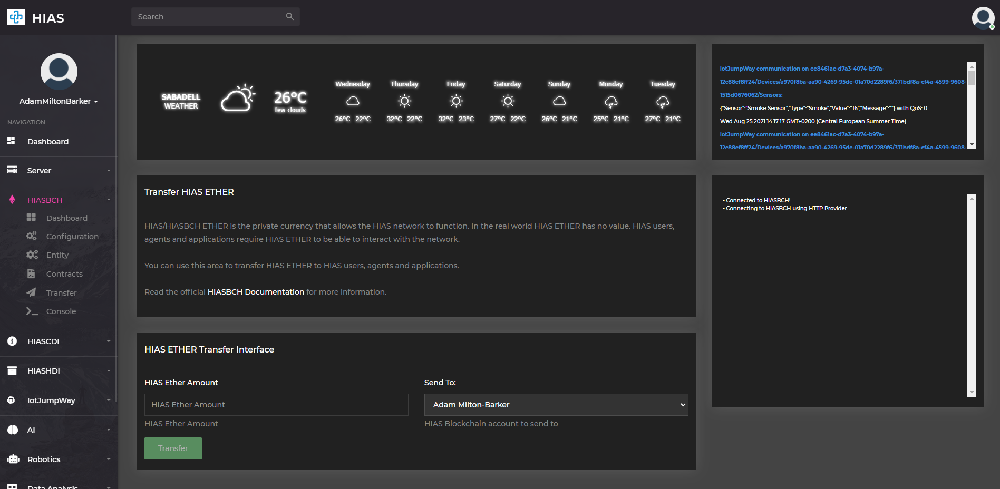

# Ubuntu Usage Guide


The following guide provides information about how to manage and use your HIASBCH Private Ethereum Blockchain.

&nbsp;

# HIASBCH
If your HIAS Core device ever loses power you will need to restart HIASBCH. From the HIAS Core project root use the following command:

``` bash
sh components/hiasbch/scripts/startup.sh
```

&nbsp;

# Component Service
The HIASBCH component software replenishes smart contracts and indexes the blocks, addresses, transactions and receipts. To manage the service use the following commands:

``` bash
sudo systemctl start HIASBCH.service
sudo systemctl stop HIASBCH.service
sudo systemctl restart HIASBCH.service
```

Providing you have completed the steps in the installation guide and updated the `config.json` file and the `credentials.json` file, you should start the service using the following command:

``` bash
sudo systemctl start HIASBCH.service
```

&nbsp;

# HIASBCH UI



The HIASBCH UI allows you to manage the configuration for HIASBCH and explore the blockchain.

## HIASBCH Explorer



You can explore your blockchain by using the HIASBCH Blockchain Explorer. To access the explorer navigate to `HIASBCH` -> `Dashboard`.

## Settings



You can manage the settings for HIASBCH by navigating to `HIASBCH` -> `Configuration`.

## Contextual Data



You can manage the contextual data for HIASBCH by navigating to `HIASBCH` -> `Entity`.

## Smart Contracts



You can manage the HIASBCH Smart Contracts by navigating to `HIASBCH` -> `Contracts`.

## Ether Transfer



You can transfer HIAS Ether to devices and applications by navigating to `HIASBCH` -> `Transfer`.

&nbsp;

# Contributing
Asociación de Investigacion en Inteligencia Artificial Para la Leucemia Peter Moss encourages and welcomes code contributions, bug fixes and enhancements from the Github community.

Please read the [CONTRIBUTING](https://github.com/AIIAL/HIASBCH/blob/main/CONTRIBUTING.md "CONTRIBUTING") document for a full guide to contributing to our research project. You will also find our code of conduct in the [Code of Conduct](https://github.com/AIIAL/HIASBCH/blob/main/CODE-OF-CONDUCT.md) document.z

## Contributors
- [Adam Milton-Barker](https://www.leukemiaairesearch.com/association/volunteers/adam-milton-barker "Adam Milton-Barker") - [Asociación de Investigacion en Inteligencia Artificial Para la Leucemia Peter Moss](https://www.leukemiaresearchassociation.ai "Asociación de Investigacion en Inteligencia Artificial Para la Leucemia Peter Moss") President/Founder & Lead Developer, Sabadell, Spain

&nbsp;

# Versioning
We use SemVer for versioning.

&nbsp;

# License
This project is licensed under the **MIT License** - see the [LICENSE](https://github.com/AIIAL/HIASBCH/blob/main/LICENSE "LICENSE") file for details.

&nbsp;

# Bugs/Issues
We use the [repo issues](https://github.com/AIIAL/HIASBCH/issues "repo issues") to track bugs and general requests related to using this project. See [CONTRIBUTING](https://github.com/AIIAL/HIASBCH/blob/main/CONTRIBUTING.md "CONTRIBUTING") for more info on how to submit bugs, feature requests and proposals.